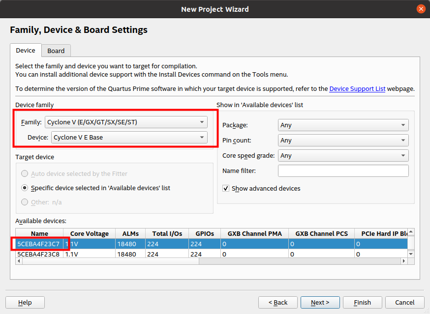
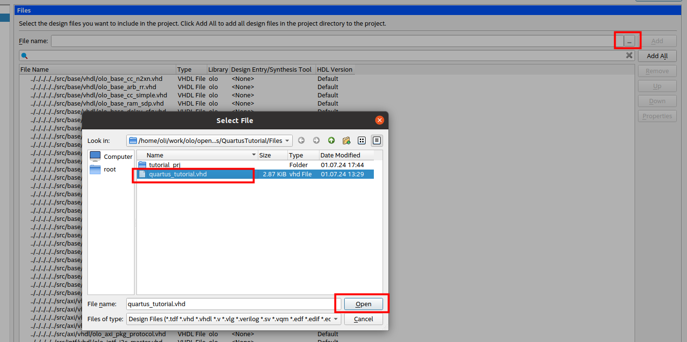
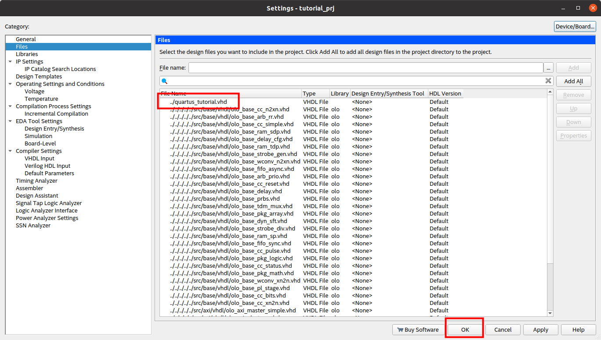
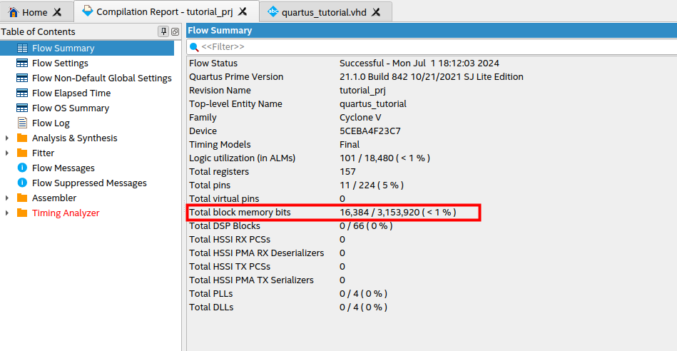
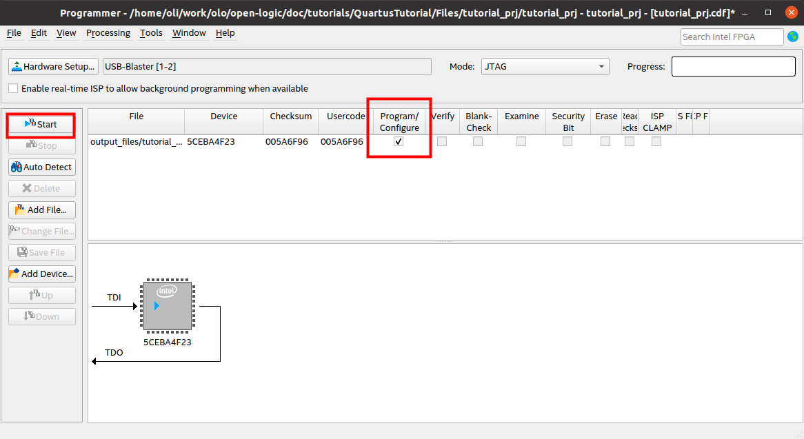

[Back to **Readme**](../../Readme.md)

# Quartus Tutorial

## Introduction

The aim of this tutorial is give users a kick-start on creating altera Quartus projects using _Open Logic_.

The tutorial covers project setup and implementation up to the production of a running bitstream for a small design.
The design is rather hardware independent but all examples and pinout constraints are given for a
[DE0-CV](https://www.terasic.com.tw/cgi-bin/page/archive.pl?Language=English&CategoryNo=163&No=921) evaluation board.
If want to use it on some other hardware, just change pinout and the target device accordingly.

The steps should be very much independent of the Quartus version but all screenshots are taken with version 21.1.0.

## Step 1: Project setup

First, create a new project.


Confirm the first page of the dialog and choose any path you like to store the project on the second page.

On the third page, it is important to create an **Empty Project**


Forward through the next page without adding any files.

As part, choose the FPGA on the DE0-CV: **5CEBA4F23C7**



You can now forward through the next two pages without changes or simply press the _Finish_ button.

## Step 2: Integrate Open Logic

We follow the steps described also in the [HowTo...](../HowTo.md) document. They are repeated here, so you do not have
to open the _HowTo_ document separately.

Open the Quartus TCL console:


For following the screenshots most closely, it is best if you navigate to the directory
\<open-logic-root\>/doc/tutorials/QuartusTutorial/Files. This step is optional, if you don't you just have to alter
paths for TCL commands accordingly.

```tcl
cd <open-logic-root>/doc/tutorials/QuartusTutorial/Files
```

Execute the command below in the TCL console:

```tcl
source <open-logic-root>/tools/quartus/import_sources.tcl
```

In the screenshot below the path on my local PC is shown - the path on your system of course is different.


You should now see a number of source files being added to the project - all of them compiled into the library _olo_.
The exact number of source files may vary as _Open Logic_ still grows.


That's it, _Open Logic_ is now ready to be used.

## Step 3: Build FPGA Design

### Overview

In this tutorial we will build the following design:


All _Open Logic_ blocks are shown in grey. Custom logic is shown in blue.

The design does de-bounce two buttons and four switches. Every time the user presses button 0, the state of the switches
is written into a FIFO (4 bits wide, 4096 entries deep). Every time the user presses button 1, one FIFO entry is read
and applied to the LEDs. Note that clock and reset are not shown in the figure for simplicity reasons.

The de-bouncing is required to ensure that a button press really only produces one edge (and hence one read/write
transaction to the FIFO). For the switches, de-bouncing is not strictly required but good style.

The design is super simple - it is not meant for demonstrating the coolest features of _Open Logic_ but for being the
simplest possible example of a design making use of _Open Logic_.

### Add Source Code

The code is provided in the file
[\<open-logic-root\>/doc/tutorials/QuartusTutorial/Files/quartus_tutorial.vhd](./QuartusTutorial/Files/quartus_tutorial.vhd).

If you are using Verilog, use the system verilog source file:
[\<open-logic-root\>/doc/tutorials/QuartusTutorial/Files/quartus_tutorial.sv](./QuartusTutorial/Files/quartus_tutorial.sv).

Add this file to the project as follows:


Navigate to the file
[\<open-logic-root\>/doc/tutorials/QuartusTutorial/Files/quartus_tutorial.vhd](./QuartusTutorial/Files/quartus_tutorial.vhd)
and add it.

If you are using Verilog, use the system verilog source file:
[\<open-logic-root\>/doc/tutorials/QuartusTutorial/Files/quartus_tutorial.sv](./QuartusTutorial/Files/quartus_tutorial.sv).



You should now see the source-file being added and you can close the dialog by clicking _OK_.



And finally select this file as top-module for the project through the right-click menu in the Project Navigator window.


### Add Constraints

The required pinout for the DE0-CV board is provided int the TCL script
[\<open-logic-root\>/doc/tutorials/QuartusTutorial/Files/pinout.xdc](./QuartusTutorial/Files/pinout.tcl). You can simply
source it from the TCL console to apply the pinout. You may user absolute or relative paths to refer to the file - of
course the path is different on your system than on the screenshot.

```tcl
source ./pinout.tcl 
```

Above command assumes you navigated to the \<open-logic-root\>/doc/tutorials/QuartusTutorial/Files directory before (see
further up in the tutorial).

You can check if the pinout was applied correctly in the Pin Planner:


You should see the following pins assigned:


If you have any problems with sourcing the TCL script, you can also enter the pinout manually in the Pin Planner.

Next a minimal set of timing constraints is added. The constraint file only defines the clock frequency in this case -
not what is state of the art for a real design but sufficient for the tutorial.

This is done by adding the file
[\<open-logic-root\>/doc/tutorials/QuartusTutorial/Files/timing.sdc](./QuartusTutorial/Files/timing.sdc) through the
_Add Files_ dialog (see [Add Source Code](#add-source-code)). Note that you must change the file-filter to _All Files_
in the dialog - by default only RTL files are visible.

### Build Design

Build the design and generate a bitstream. You can just press the _Start Compilation_ button - Quartus will detect
automatically run all required steps of the flow.


After successful compilation, Quartus automatically displays the Compilation Report.

### Analyze Resource Utilization

From the resource utilization it is obvious that the FIFO was correctly mapped to Block-RAM.

The LUT usage also demonstrates the efficiency of _Open Logic_: If the de-bouncing would be implemented in the most
simple form (one counter per signal running on the system clock directly), the de-bouncing alone would use 101 ALMs (6
signals x 25ms @ 50 MHz --> 126 counter bits). The overall LUT count of the design is only 101 - and this includes the
FIFO.



### Analyze Timing

The timing report shows that unsurprisingly the slow clock-speed of the 50 MHz clock is met. It also shows missing
output and input delays - which is acceptable for a tutorial but should be fixed by adding constraints in a real-world
project.

**IMPORTANT NOTE**: For Quartus scoped constraints do not work and all constraints must be entered manually (see
documentation of individual components that require constraints like interface components and clock crossings). This is
why in contrast to the [Vivado Tutorial](./VivadoTutorial.md), input delays are reported missing for Quartus.


## Step 4: Try it on Hardware

Now connect your [DE0-CV](https://www.terasic.com.tw/cgi-bin/page/archive.pl?Language=English&CategoryNo=163&No=921)
hardware to your PC using the USB cable.

Open the Programmer:


Program the device:



You can now dial in values using the _Switches_ and write them into the FIFO by pressing _Button 0_ (on the very right).
After that they can be read from the FIFO and displayed one by one by pressing _Button 1_ (second from the right).

## Step 5: Discussion of the VHDL Source Code

The source code can be found in the file
[\<open-logic-root\>/doc/tutorials/QuartusTutorial/Files/quartus_tutorial.vhd](./QuartusTutorial/Files/quartus_tutorial.vhd).

Not every line of the source code is discussed. It is simple and implements the design described earlier. Only a few
details worth mentioning are discussed.

The source code samples given are VHDL - however, for the verilog example file the code looks very much the same and the
comments apply as well.

### Omitting Unused Generics

The FIFO instance only sets two generics:

```vhdl
    i_fifo : entity olo.olo_base_fifo_sync
        generic map ( 
            Width_g         => 4,               
            Depth_g         => 4096                 
        )
        ...
```

The _olo_base_fifo_sync_ entity would have much more generics but due to the concept of providing default values for
optional generics, it is not necessary to obfuscate source-code with many lines of actually unused generics.

```vhdl
entity olo_base_fifo_sync is
    generic ( 
        Width_g         : positive;                   
        Depth_g         : positive;                  
        AlmFullOn_g     : boolean   := false;        
        AlmFullLevel_g  : natural   := 0;                   
        AlmEmptyOn_g    : boolean   := false;        
        AlmEmptyLevel_g : natural   := 0;                   
        RamStyle_g      : string    := "auto";       
        RamBehavior_g   : string    := "RBW";        
        ReadyRstState_g : std_logic := '1'
    );
    ...
```

### Omitting Unused Ports

The same concept applies to unused ports. In this case we do neither require full handshaking nor status signals like
Full/Empty/Level - hence all these signals can be omitted:

```vhdl
    i_fifo : entity olo.olo_base_fifo_sync
        ...
        port map (    
              Clk           => Clk,
              Rst           => Rst,
              In_Data       => Switches_Sync,
              In_Valid      => RisingEdges(0),
              Out_Data      => Led,
              Out_Ready     => RisingEdges(1)              
        );
```

Again compared to the full list of signals the _olo_base_fifo_sync_ provides many lines of obfuscating code can be
omitted because all optional input ports come with default values.

```vhdl
entity olo_base_fifo_sync is
    ...
    port (    
        -- Control Ports
          Clk           : in  std_logic;
          Rst           : in  std_logic;
          -- Input Data
          In_Data       : in  std_logic_vector(Width_g - 1 downto 0);
          In_Valid      : in  std_logic                                             := '1';
          In_Ready      : out std_logic;
          In_Level      : out std_logic_vector(log2ceil(Depth_g + 1) - 1 downto 0);
          -- Output Data
          Out_Data      : out std_logic_vector(Width_g - 1 downto 0);
          Out_Valid     : out std_logic;
          Out_Ready     : in  std_logic                                             := '1';
          Out_Level     : out std_logic_vector(log2ceil(Depth_g + 1) - 1 downto 0);
          -- Status
          Full          : out std_logic; 
          AlmFull       : out std_logic;
          Empty         : out std_logic; 
          AlmEmpty      : out std_logic
          
    );
```

## Notes

If you should want to build the tutorial project without many manual mouse clicks, you can do so by following the steps
below:

- Open Quartus
- Open the TCL console - as described in the tutorial
- In the TCL console, navigate to the directory \<open-logic-root\>/doc/tutorials/QuartusTutorial/Files
  
  ```tcl
  cd <open-logic-root>/doc/tutorials/QuartusTutorial/Files
  ```

- Run the script [scripted_build.tcl](./QuartusTutorial/Files/scripted_build.tcl), which creates and builds the tutorial
  project: <br>
  For VHDL:
  
  ```tcl
  source scripted_build.tcl
  ```
  
  For Verilog:
  
  ```tcl
  source scripted_build_sv.tcl
  ```

Note: replace \<open-logic-root\> with the root folder of your _Open Logic_ working copy.
